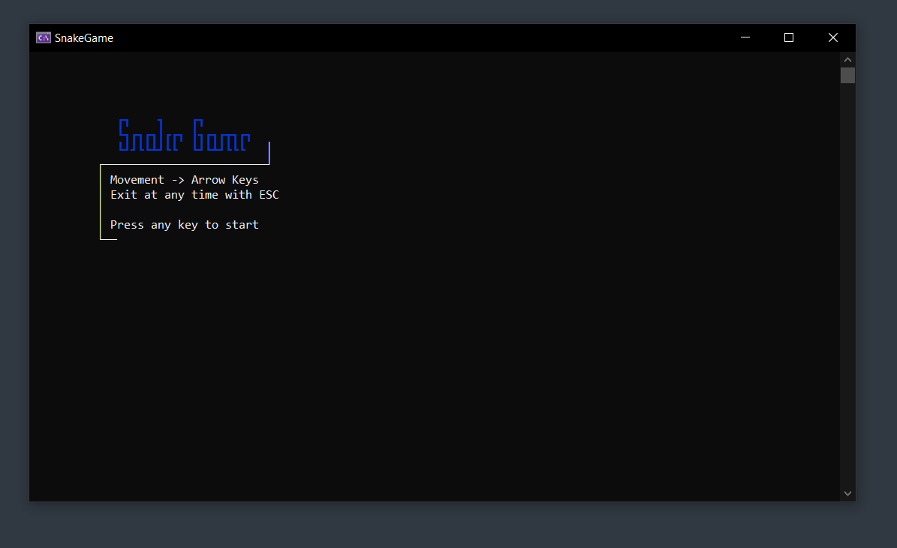
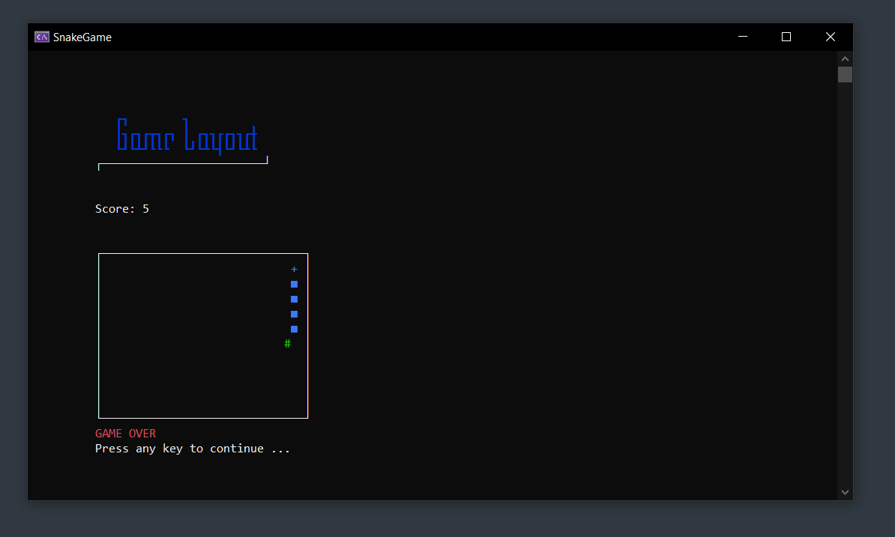

<h1 align="center">
  SnakeGame
</h1>

---

This project is basically a simple clone of the classic Snake Game.
The goal of this project was to train the handling of two-dimensional arrays
and also to test the ability to execute asynchronous tasks in parallel.

---

## Other services used
- The website [patorjk.com](https://patorjk.com/software/taag/#p=display&f=Tmplr) was used for creating headers within the application.

## How it Works

- Within the `ApplicationSettings.cs` file the user can adjust the game settings.
- After starting the application and pressing any key except `ESC` the game starts.
- The body and the head of the snake will be moved accordingly.
- When pressing any of the `arrow keys` the snake direction changes.
- When collecting a fruit, the body will grow larger.
- When a collision with the snakes body or the border of the field layout is detected, the game ends.
- Long story short, it works just like the original Snake game.

## Default layout characters
- ' ' -> empty space
- '**+**' -> snake head
- '**■**' -> snake body
- '**#**' -> default fruit

## How to Run

1. Clone this repository:
   ```bash git clone https://github.com/mLoDar/SnakeGame.git```

2. Open the solution file `(.sln)` in Visual Studio.

3. Build the project and run it.

## Screenshots

<p align="center">
    
    <br>
    <br>
    
</p>

## Future Improvements

- [ ] Adding different sorts of fruits
- [ ] Adding obstacles
- [ ] Add ability to change settings within the application
   
---

<p align="center">
    <i>
        Feel free to submit pull requests or issues!
    </i>
</p>
